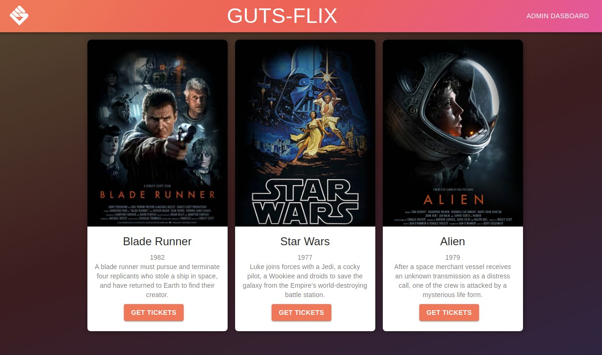
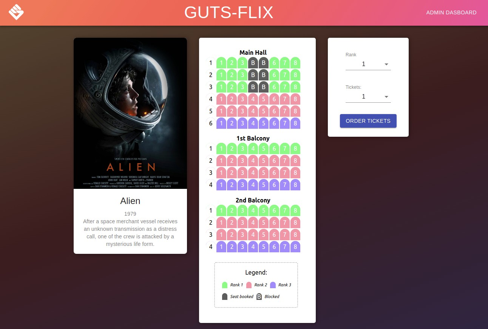
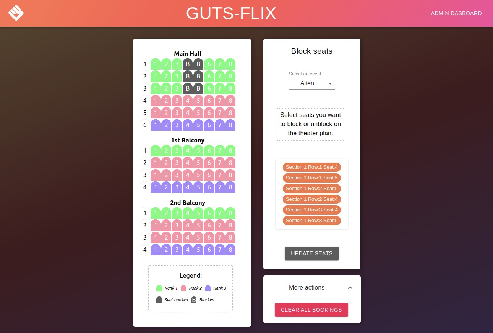

# Theater Seating Algorithm

#### Please first clone the API from here: [theater_seating_algorithm_api](https://github.com/mr-robak/theater_seating_algorithm_api)

---

1. [Setup](#setup)
2. [Overview](#overview)
3. [Features](#features)

   - [Home page](#home-page)
   - [Reservations](#reservations)
   - [Admin dashboard](#admin-dashboard)

4. [Technologies used:](#technologies-used)

---

## Setup

I recommend to start by cloning the API first since it is needed for the app to work. Please follow the instructions here: [theater_seating_algorithm_api](https://github.com/mr-robak/theater_seating_algorithm_api). After this is done you can return here to continue setting up the app.

To begin please clone the repository to your local environment:

    git clone https://github.com/mr-robak/theater_seating_client

Next, navigate to the app folder:

    cd theater_seating_client

and install the dependencies by running in the terminal:

    npm install

To launch the app please run:

    npm start

It runs the app in the development mode.
Open [http://localhost:3000](http://localhost:3000) to view it in the browser.

---

## Overview

This app serves as a frontend client for an algorithm that given a array of "users" per rank of seats in a specific order (e.g. [1, 3, 4, 4, 5, 1, 2, 4] ), tries to place the users in their seats, e.g.

    1 2 2 2 3 3 3 3
    5 5 5 5 4 4 4 4
    5 6 7 7 8 8 8 8

So the group of size 1 at index 1 gets the front most left seat. Then the group at index 2 of 3 people next to it, until the row fills and wraps to the next row and fills in the other direction.

---

## Features

## Home page

Here we get an overview of the available events. Cards are rendered using pre-defined movie list.

Clicking an image or [Get Ticket] button takes user to this even's [Booking page](#reservations).

---

## Reservations

The page is served on a dynamic route that includes event id.
Th Id read from the rout parameters is used to fetch a correct data file from the API and render it as the theater layout.

Theater layout is a dynamic rendering of the layout dataset, meaning if we add a row in the backend data it will render it dynamically without any changes to the code.

Here we can select a seat rank and number of tickets we want to book.
Upon submission the request is sent to API that runs seating algorithm and returns an updated layout with success confirmation via a custom notification.

---

## Admin Dashboard

This page is set up to allow admin to be able to block certain seats which in return influences how the seats are assigned at the Reservation stage.

Admin is able to select/deselect desired seats by clicking them on the layout and sending the data seats object to the API which return an updated layout.

There is also an option to reset all bookings which replaces the data set in the backend with a default empty one.

## Technologies used:

### Client:

- [React.js](https://github.com/facebook/react)

- [react-router-dom](https://github.com/ReactTraining/react-router/tree/master/packages/react-router-dom)

- [Emotion CSS](https://github.com/emotion-js/emotion)

- [Material UI](https://github.com/mui-org/material-ui)

- [Axios](https://github.com/axios/axios)

---

### Server:

- [node.js](https://github.com/nodejs)

- [express server](https://github.com/expressjs/express)

- [cors](https://github.com/expressjs/cors)

- [body-parser](https://github.com/expressjs/body-parser)

#### See the backend repository here: [theater_seating_algorithm_api](https://github.com/mr-robak/theater_seating_algorithm_api)
